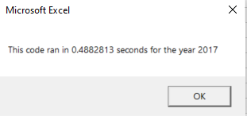

# Green Stock Analysis

## Overview of Project
The purpose of this analysis is to utilize VBA within Excel to automatically perform analysis on the trading volume and rate of return for each stock (by ticker) avaialble on the historical dataset, based on the year chosen by the user. On the tab named "All Stock Analysis", the user can click on the button named "Run Stock Analysis Refactored", input the year of which the analysis should be performed, and the results are populated on column A to C. At a glance, the user can quickly determine the best performing stocks and compare against the performance of the rest of the stocks.

## Results

### All Stocks Analysis 2017
</img>

### All Stocks Analysis 2018
</img>

As shown in above images, most stocks performed well in the year of 2017 with the exception of TERP. However, in 2018, most stocks performed badly with th exception of ENPH and RUN. Notably, ENPH consistently outperformed in both years, with returns of 129.5% in 2017 and 81.9% in 2018, and was the most traded stock in both years. In addition, RUN performed even better in 2018 with a return of 84% and was traded more often than prior year when most of its peers have shown negative returns. Lastly, DQ appeared to be the most volatile stock with both the highest return in 2017 at 199% and the lost the most value in 2018 with a drop of 63%.

## How does the code work?

There were two versions of codes created for the purpose of this analysis. Both scripts provided the same results, but the refactored script runs significantly faster than the original script, as shown in below screenshots.

- Below screenshots show the elapsed run time in the original script
</img>
</img>

- Below screenshots show the elapsed run time in the refactored script
</img>
</img>

Both scripts begin by creating a variable based on user's input on the year of interest, formats the output sheet on the tab named "All Stocks Analysis" based on the year selected by the user. The first column for tickers was created as an array, with each element assigned with its own ticker, as shown below.

    Dim tickers(12) As String
    
    tickers(0) = "AY"
    tickers(1) = "CSIQ"
    tickers(2) = "DQ"
    tickers(3) = "ENPH"
    tickers(4) = "FSLR"
    tickers(5) = "HASI"
    tickers(6) = "JKS"
    tickers(7) = "RUN"
    tickers(8) = "SEDG"
    tickers(9) = "SPWR"
    tickers(10) = "TERP"
    tickers(11) = "VSLR"

The worksheet selected by the user (based on year) is activated, and the number of rows is calculated as variable that can be used in the for loop. StartingPrice and endingPrice were initiated as a variable for the loop as well. The difference between the original and the refactored script is that the refractored script also creates a tickerIndex variable to be used to drive the calculations for ticker volumes, starting prices and ending prices. Whereas the original script has no dependence on the tickerIndex but intead relies on the name of the ticker.

- Below is a partial extract of the refactored script, using a nested for loop to run through all the tickers and rows to add up the relevant daily volume for each ticker based on tickerIndex.

        '1a) Create a ticker Index
        tickerIndex = 0

        '1b) Create three output arrays
        Dim tickerVolumes(12) As Long
        Dim tickerStartingPrices(12) As Single
        Dim tickerEndingPrices(12) As Single
    
        ''2a) Create a for loop to initialize the tickerVolumes to zero.
    
    
        For j = 0 To 11
        ticker = tickers(j)
        tickerVolumes(tickerIndex) = 0
        
            
        ''2b) Loop over all the rows in the spreadsheet.
        For i = 2 To RowCount

            '3a) Increase volume for current ticker (To increase the volume of the current tickerVolumes by using the tickerIndex variable as the index)
            If Cells(i, 1).Value = ticker Then
                         
            tickerVolumes(tickerIndex) = tickerVolumes(tickerIndex) + Cells(i, 8).Value
            
            End If

In both the original and refactored script, the starting price and ending price were determined based on an If statement to check whether or not the tickers before or after the current row are different. In the refactored script, the tickerIndex is increased by 1 at the end of the loop, such that it is reflected in the next loop.

At the end of the scripts, a for loop is created to loop through the arrays and output the Ticker, Total Daily Volume, and Return. Lastly, a few lines of codes were written to format the output summary.

## Summary

In general, the main advantage of the refactoring code is that it allows one to take a step back and gain a better understanding of the big picture and structure of the code. In doing so, one can better understand the logic and flow of the pattern, and identify more efficient ways to modify the code, simplify it, and fix some bugs. The disadvantage of refactoring code is that it is very time consuming to go over the entire code to identify room for improvement, espcially if the code a is very long, complicated code created by someone else. Refactoring an existing code (most probably created by someone else) could easily lead to unintentional errors and end up changing the functionality of the code by mistake.

The main advantage of the refactored code in the Stock Analysis is that it runs faster. As the dataset expands to hold more historical data on stock performances, perhaps with more stocks and more years of daily stock prices, the refactored code is better situated to handle the expansion as a tickerIndex is created for this purpose, of which each data extraction or calculation is based on this tickerIndex. The disadvantage of the refactored code is that this changes the logic of how the loops are performed, and how the outputs are presented. Although it runs faster, there are many items along the code that needs to be modified accordingly because of a new variable being created. It is easy the miss a change and the code wouldn't function normally, which could take a long time to debug.

The main advantage of the original code is that it is more straight forward with less variables. Therefore, it is easier to understand the flow and logic of the code. The disadvantage is that it runs slower than the refactored code, and the time difference could be more siginficant as the dataset expands.